# TogoSpace 架构图

## 1. 系统总览

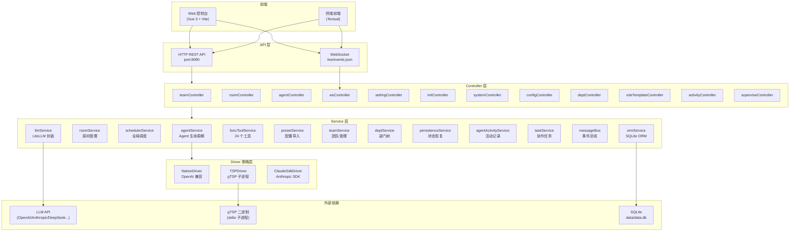

## 2. 四层架构规则

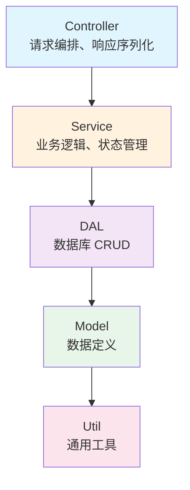

| 层 | 可 import | 说明 |
|----|-----------|------|
| `controller` | `service` + `dal` + `model` + `util` | HTTP / WebSocket 接口层 |
| `service` | `dal` + `model` + `util` | 有状态业务逻辑 |
| `dal` | `model` + `util` | 数据访问层 |
| `model` | `util` | 数据定义 |
| `util` | 标准库 + 第三方 | 通用工具 |

- 同层可互相引用，禁止下层反向依赖上层。
- 入口模块 `backend_main.py` 启动后会 `chdir` 到 `src/`。

## 3. 启动流程（4 阶段）

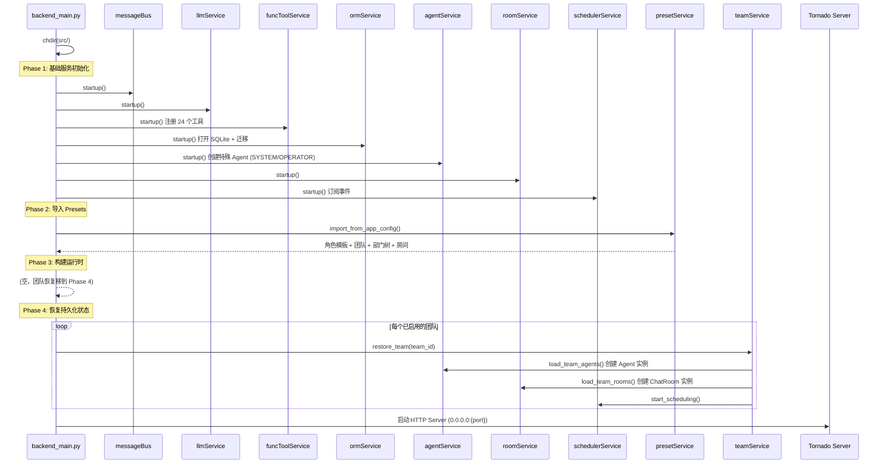

## 4. 请求处理流程（用户发消息）

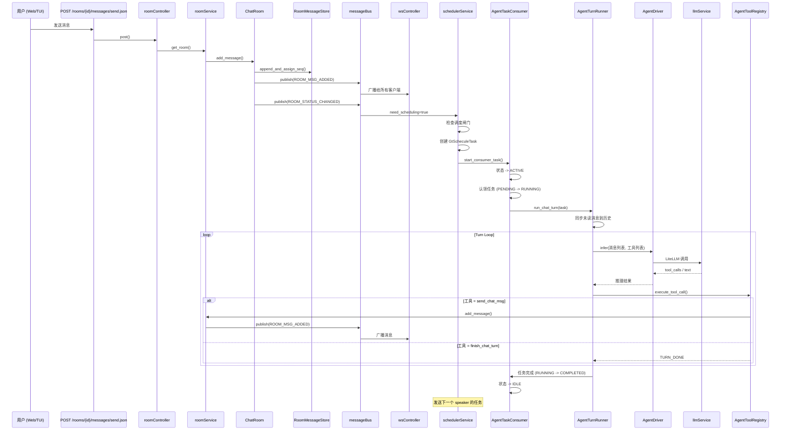

## 5. Agent 生命周期

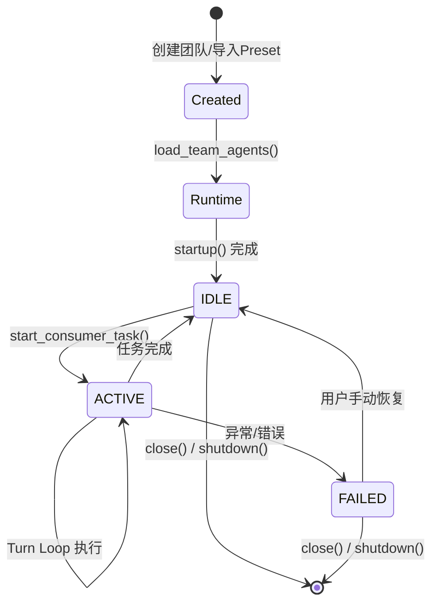

### Task 生命周期

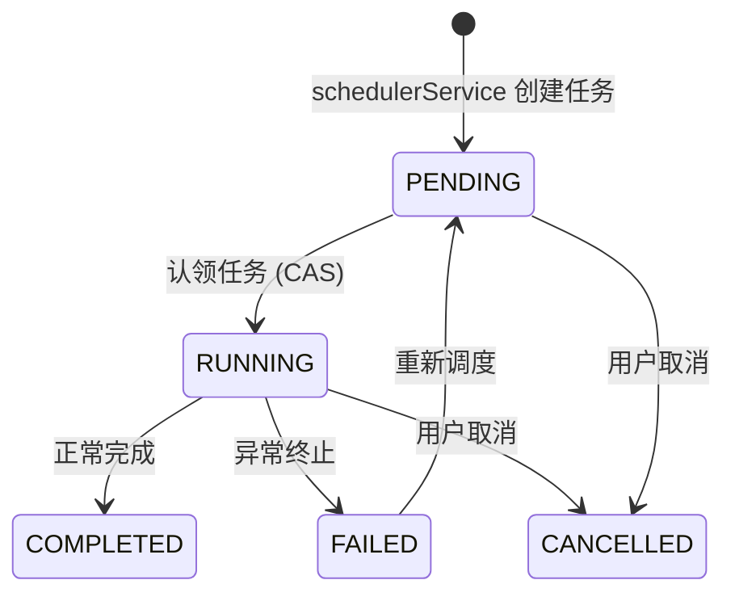

## 6. Driver 策略架构

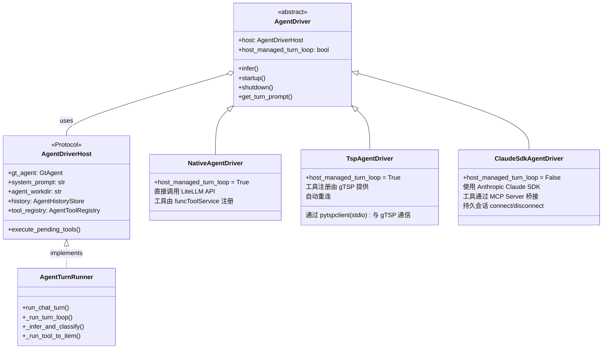

| 特性 | Native | TSP | Claude SDK |
|------|--------|-----|------------|
| Turn Loop 控制 | Host | Host | Driver 自身 |
| 工具注册 | funcToolService | gTSP + funcToolService | funcToolService via MCP |
| 通信方式 | 直接 LiteLLM API | stdio 子进程 | Claude SDK 持久会话 |
| 最大重试 | 3 | 3 | 3 |
| 连接管理 | 无状态 | 自动重连 | 持久 connect/disconnect |
| 沙箱隔离 | 无 | 进程级隔离 | SDK 封装 |

## 7. 房间状态机

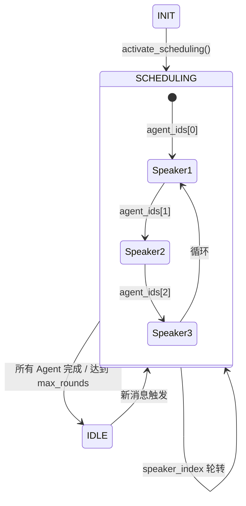

| 类型 | 成员 | 行为 |
|------|------|------|
| **PRIVATE** | 1 Operator + 1 AI Agent | Operator 消息在 Agent 发言时排队 |
| **GROUP** | 多 AI Agent (+ 可选 Operator) | 轮转发言，按轮次跳过跟踪 |

## 8. 事件总线

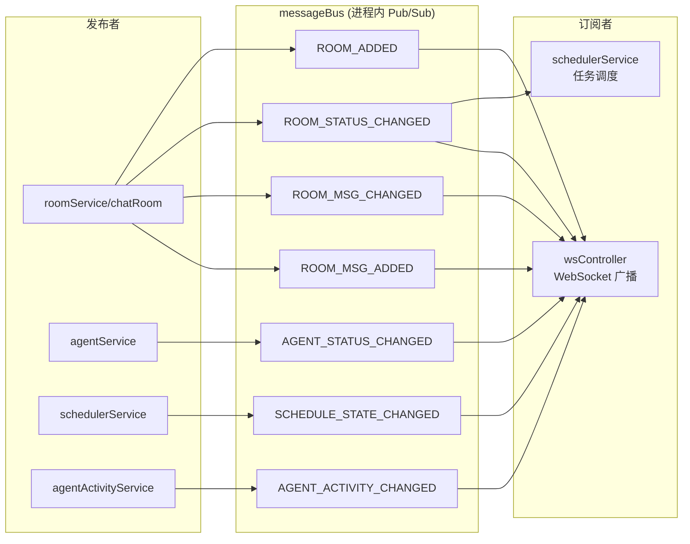

## 9. 数据库 Schema

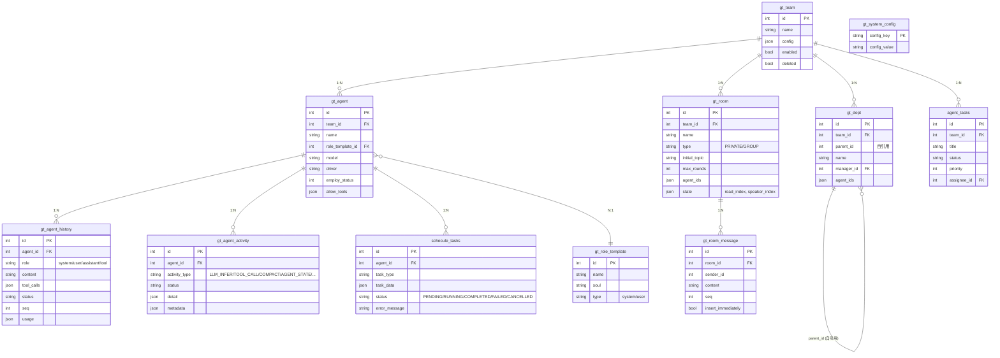

## 10. 调度闸门

```mermaid
stateDiagram-v2
    STOPPED --> BLOCKED: 未配置 LLM / 演示模式 / 错误
    BLOCKED --> RUNNING: 配置完成 / 解除阻塞
    RUNNING --> BLOCKED: LLM 不可用 / 错误发生
    RUNNING --> STOPPED: 全局停止
    STOPPED --> STOPPED: 一直

    state BLOCKED {
        note: 调度器不创建新任务<br/>现有任务可继续完成
    }

    state RUNNING {
        note: 房间激活 -> 创建任务<br/>Agent IDLE -> 领取任务
    }
```

## 11. 目录结构（基于 STORAGE_ROOT）

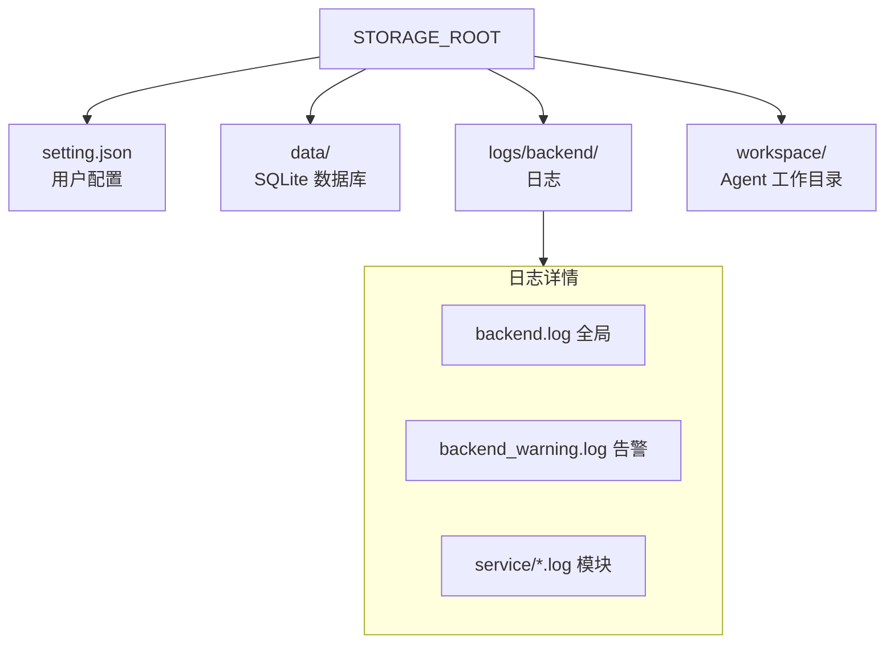

| 运行模式 | STORAGE_ROOT |
|----------|-------------|
| 开发模式 | `repo/dev_storage_root/` |
| 打包模式 | `~/.togo_agent/` |
| Docker | 环境变量 `STORAGE_ROOT` 指定 |

## 12. API 路由总览

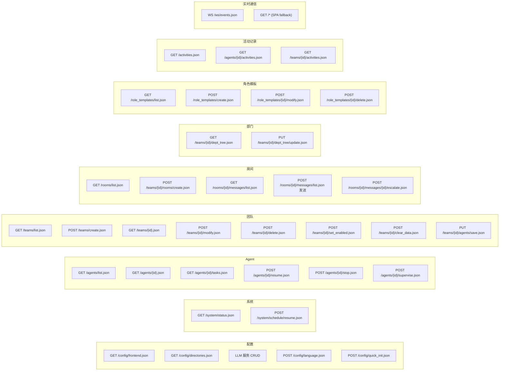

## 13. Turn Loop 详细流程

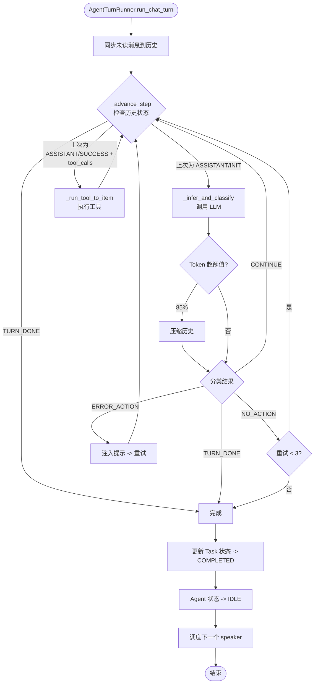

## 14. 工具分类

| 分类 | 工具 | 作用域 |
|------|------|--------|
| **BASIC** | `get_time`, `send_chat_msg`, `finish_chat_turn`, `get_dept_info`, `get_room_info`, `get_agent_info`, `wake_up_agent`, `start_chat`, `create_task`, `update_task`, `get_task`, `list_tasks` | 全驱动 |
| **ADMIN** | `reload_team`, `list_role_templates`, `get_role_template`, `save_agent`, `save_dept`, `delete_dept`, `save_room`, `delete_room`, `save_role_template`, `delete_role_template` | 全驱动 |
| **READ** | `list_dir`, `read_file` | TSP 专属 |
| **WRITE** | `write_file` | TSP 专属 |
| **EXECUTE** | `execute_bash` | TSP 专属 |

## 15. 关键设计模式

| 模式 | 应用位置 | 说明 |
|------|---------|------|
| **Facade** | `Agent` / `ChatRoom` | 对外暴露简洁接口，内部委托子组件 |
| **Strategy** | `AgentDriver` 体系 | 三种驱动可互换 |
| **State Machine** | `RoomScheduler` / `AgentHistoryStore` | 状态转换有严格规则 |
| **Pub/Sub** | `messageBus` | 生产者与消费者解耦 |
| **CAS** | `gtScheculeTaskManager` | 任务认领防重复消费 |
| **Protocol** | `AgentDriverHost` | Python 结构化类型，松耦合 |
